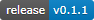

.. image:: docs/source/python_classic_2_5_tag.png
    :target: https://www.python.org/download/releases/2.5.4/
    

    
.. image:: https://readthedocs.org/projects/travliteguide/badge/?version=latest
    :target: http://travliteguide.readthedocs.io/en/latest/?badge=latest
    :alt: Doc Status

**LITE CharGen for Traveller 0.1.1**
====================================

This **LITE CharGen for Traveller** is a Classic Python 2.5 program for generating NPCs for Traveller. Running in a web browser is now being tested with this release.

Read the **TravLITE Guide** at http://travliteguide.readthedocs.io

Requirements
------------

* **Windows XP/7/8/10**

   It might not work in OSX or Linux.

* **bottle 0.12.13**

   bottle testing has begun with the release of 0.1.0.
   
* **colorama 0.2.7**

   Because the dice roller may have some colored text messages for debugging. The colorama
   code in diceroll.py can be removed if it is not needed, however.
   
* **py2exe 0.6.9**

   Used by setup_TL.py for making EXEs of the Python code. Optional.

Promo
-----

.. image:: images/video.png
    :target: https://www.youtube.com/watch?v=VhvVPNhoPl4

Warning
-------

**LITE CharGen for Traveller** will not work with **Python 2.6+**.

Contact
-------
Questions? Please contact shawndriscoll@hotmail.com

The Traveller game in all forms is owned by Far Future Enterprises.
Copyright 1977 - 2021 Far Future Enterprises.
Traveller is a registered trademark of Far Future Enterprises.
