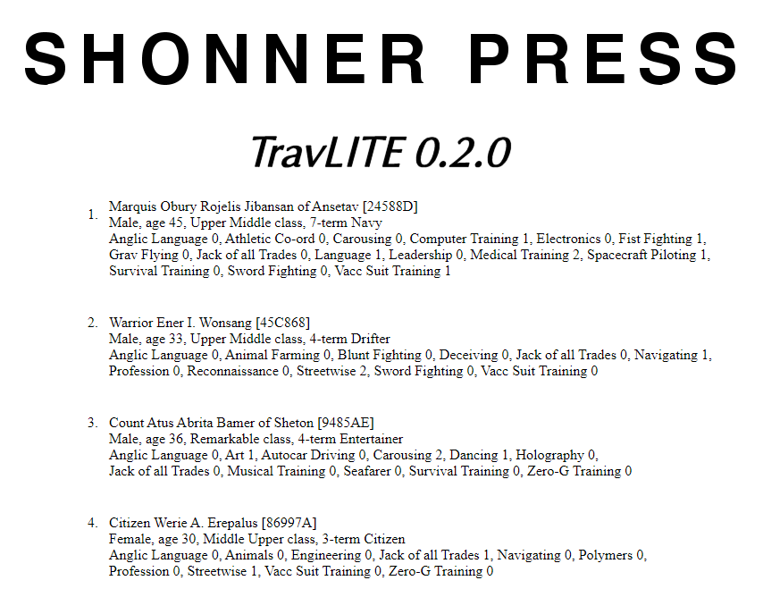
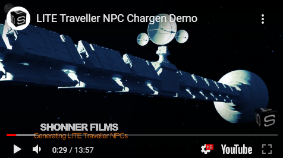

    

    
.. image:: https://readthedocs.org/projects/travliteguide/badge/?version=latest
    :target: http://travliteguide.readthedocs.io/en/latest/?badge=latest
    :alt: Doc Status

.. image:: https://img.shields.io/github/stars/ShawnDriscoll/Traveller-NPC-LITE.svg
	:target: https://github.com/ShawnDriscoll/Traveller-NPC-LITE/stargazers

**TravLITE 0.2.0: CharGen for Traveller**
=========================================

**TravLITE** is a Classic Python 2.5 program for generating NPCs for Traveller. Running in a web browser is now being tested with this release.

Read the **TravLITE Guide** at http://travliteguide.readthedocs.io

Download the PDF from https://readthedocs.org/projects/travliteguide/downloads/pdf/latest

or the EPUB from https://readthedocs.org/projects/travliteguide/downloads/epub/latest

Requirements
------------

* **Windows 10**

   It might not work in OSX or Linux.

* **bottle 0.12.13**

   bottle testing has begun with the release of 0.1.0.
   
* **colorama 0.2.7**

   Because the dice roller may have some colored text messages for debugging.
   
* **simplejson 3.11.1**

   Used for saving data in JSON format. Beginning with release 0.2.0.
   
* **py2exe 0.6.9**

   Used by setup_TL.py for making EXEs of the Python code for you. Optional.

Promo
-----

Warning
-------

**TravLITE** will not work with **Python 2.6+**.

Contact
-------
Questions? Please contact shawndriscoll@hotmail.com

The Traveller game in all forms is owned by Far Future Enterprises.
Copyright 1977 - 2021 Far Future Enterprises.
Traveller is a registered trademark of Far Future Enterprises.
